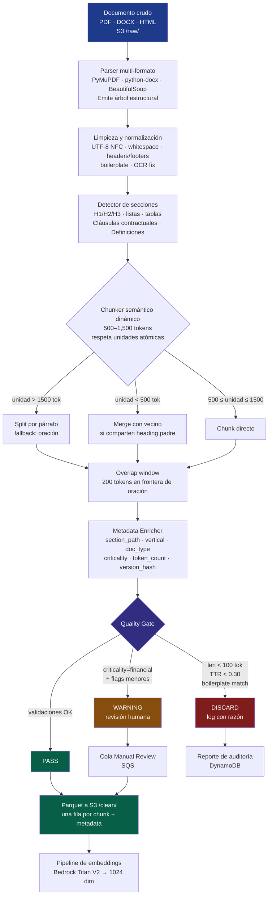

# Semantic Chunking Pattern — Diseño del Patrón de Segmentación Documental

**Documento:** 03 — Patrón de Diseño LLM (Semantic Chunking)
**Proyecto:** LLM Data Engineering Pipeline (Proyecto 12 — BSG Institute)
**Versión:** 1.0
**Fecha:** 2026-05-24
**Audiencia:** Equipo técnico Acme Co (Data Engineering + ML) + Comité técnico

---

## Resumen ejecutivo

El **Semantic Chunking Pattern** es el patrón de diseño elegido como pieza central del pipeline. Resuelve la tensión entre **fidelidad semántica** (mantener intactas cláusulas legales, definiciones técnicas, paquetes comerciales) y **eficiencia de recuperación** (vectores de tamaño adecuado para búsqueda ANN en `pgvector`). Es obligatorio por la rúbrica del Proyecto 12 y, en el contexto del Marketplace B2B PyME de Acme Co, es **no negociable** porque el subset financiero crítico (Carrier Billing, 24% APR, scoring) exige que la cita devuelta corresponda a la cláusula contractual exacta, no a una ventana arbitraria de caracteres.

El patrón opera en siete etapas pipeline-friendly: parser multi-formato → limpieza → detección de secciones → chunker semántico dinámico → enriquecimiento de metadata → quality gate → emisión a Parquet. Tamaño de chunk dinámico **500–1,500 tokens** con **overlap de 200 tokens**, respetando la jerarquía estructural del documento (H1/H2/H3, bullets, tablas, cláusulas). El Quality Gate **descarta o marca para revisión** chunks pobres (boilerplate, ruido OCR, fragmentos huérfanos), con una excepción explícita: cualquier chunk con marcadores financieros regulados nunca se descarta — sólo se marca para revisión humana.

---

## 1. Descripción conceptual

### 1.1 Qué es el Semantic Chunking Pattern

El Semantic Chunking Pattern es una estrategia de segmentación documental que **respeta la estructura semántica natural del documento** — secciones, cláusulas, definiciones, listas, tablas — y produce chunks de **tamaño dinámico** dentro de un rango operativo, en lugar de aplicar un corte ciego por longitud fija. Cada chunk emitido conserva metadata estructural rica (jerarquía de sección, tipo de contenido, vertical de negocio, criticidad regulatoria) que el indexador y el motor de recuperación pueden aprovechar para filtrar, rankear y citar con precisión a nivel de cláusula o párrafo, no a nivel de "página tal del PDF tal".

### 1.2 Por qué es la elección correcta para Acme Co

El corpus del Marketplace B2B PyME mezcla **cuatro registros lingüísticos y dos clases de criticidad** simultáneamente: contratos Carrier Billing con cláusulas regulables por CNBV, manuales técnicos de AcmeCo Negocios, dossiers ICP de "PyME Digital" por vertical (Moda, Belleza, Joyería, Mascotas), y FAQs formativos. Un único umbral de chunking fijo nunca puede servir bien a los cuatro: una cláusula contractual de 300 tokens debe entrar completa en un chunk; un manual técnico de 4,000 tokens debe partirse por sub-sección, no por carácter; una FAQ corta debe agruparse con su pregunta-respuesta, no fragmentarse. El patrón semántico es la única estrategia que escala a la heterogeneidad real del corpus sin requerir un pipeline distinto por tipo de documento.

---

## 2. Pasos del patrón (operación end-to-end)

1. **Parsing multi-formato.** Extracción de texto y de estructura (headings, bullets, tablas) desde PDF (PyMuPDF para layout-aware + PyPDF2 fallback), DOCX (`python-docx`) y HTML (`BeautifulSoup` + `markdownify`). El parser emite un *árbol estructural* — no plain text — que conserva niveles de heading, marcadores de tabla, listas y referencias a página de origen.
2. **Limpieza y normalización.** Conversión a UTF-8 NFC, remoción de caracteres no imprimibles, normalización de whitespace, sanitización de HTML residual, detección y eliminación de **headers/footers repetidos** mediante análisis de n-gramas entre páginas del mismo documento, y remoción de boilerplate común (numeración de página, watermarks, "Confidencial — uso interno").
3. **Detección de secciones.** Reconstrucción de la jerarquía documental: H1 / H2 / H3, listas anidadas, tablas, y en contratos la identificación de **unidades clausulares** ("Cláusula 4.2", "Anexo II", "Definiciones") mediante heurísticas regex + estructura del parser. Cada unidad recibe un `section_path` jerárquico (ej. `Contrato Carrier Billing > 4. Default Management > 4.2 Cargos por mora`).
4. **Chunker semántico dinámico.** Recorrido del árbol estructural produciendo chunks que respetan **tres reglas en orden de precedencia**: (a) nunca partir una unidad atómica indivisible (cláusula contractual, definición, tabla, ítem de lista); (b) cada chunk debe medir entre 500 y 1,500 tokens; (c) si una unidad excede 1,500 tokens, se parte respetando fronteras de párrafo y, en último recurso, fronteras de oración (`spaCy` o tokenizador de oraciones para español). Si una unidad es menor a 500 tokens, se fusiona con la siguiente **sólo si comparten el mismo padre de heading**.
5. **Overlap de contexto.** Aplicación de ventana deslizante de **200 tokens** del final del chunk N al inicio del chunk N+1, **respetando frontera de oración** (no se parte en medio de palabra). El overlap se ancla en oraciones completas para evitar pérdida de contexto cross-chunk en consultas que cruzan secciones (típico en preguntas sobre relaciones cláusula ↔ definición).
6. **Enriquecimiento de metadata.** Cada chunk se etiqueta con: `chunk_id`, `document_id`, `chunk_index`, `section_path`, `section_level`, `chunk_type` (texto/tabla/cláusula/lista/FAQ), `vertical` (Moda/Belleza/Joyería/Mascotas/general), `doc_type` (catálogo/contrato/dossier/manual/caso/política/SLA/proceso/formativo), `criticality` (financial/legal/operational/informational), `source_filename`, `source_page`, `token_count`, `char_count`, `language` (esperado `es-MX`), `created_at`, `version_hash`.
7. **Quality Gate.** Cada chunk pasa por validaciones automáticas (sección 5) y se emite con uno de tres estados: `pass` (al pipeline de embeddings), `warning` (a cola de revisión humana), `discard` (rechazado, registrado para auditoría con razón). Los chunks con `criticality=financial` **nunca son descartados** automáticamente — sólo marcados.
8. **Emisión a Parquet.** Salida en formato Parquet en S3 (`/clean/`), una fila por chunk, con todas las metadatas anteriores + el texto del chunk. Ese archivo es input del componente de embeddings (Prompt 7).

---

## 3. Diagrama del patrón (Mermaid)



---

## 4. Requisitos técnicos del diseño

| Requisito | Valor objetivo | Notas |
|---|---|---|
| Tamaño mínimo de chunk | **500 tokens** | Excepción: FAQs cortas se fusionan con su pregunta padre |
| Tamaño máximo de chunk | **1,500 tokens** | Margen amplio frente al límite de 8,192 tokens de Titan V2 |
| Overlap entre chunks | **200 tokens** | Anclado en frontera de oración |
| Tokenizador de referencia | `cl100k_base` (`tiktoken`) | Aproxima bien al tokenizador interno de Titan |
| Idioma esperado | `es-MX` | Otros idiomas → `warning` (no descarte) |
| Unidades atómicas indivisibles | Cláusula contractual · Definición · Tabla · Item de lista | Nunca se parten, aunque excedan 1,500 tokens (warning, no split) |
| Profundidad de jerarquía preservada | Hasta H4 | H5+ aplanado al padre H4 |
| Formato de salida | Parquet (columnar, comprimido Snappy) | Una fila por chunk, ~25 columnas de metadata |
| Idempotencia | Sí, por `version_hash(document_id + content_hash)` | Re-procesar mismo documento produce mismo `chunk_id` |
| Throughput objetivo | ≥ 100 docs/min (Lambda paralelizada) | 500 docs / 5 min ≤ techo de pipeline |

### 4.1 Política de tamaño dinámico

```
si tamaño(unidad_semántica) < 500 tokens:
    si comparte heading padre con vecino N+1:
        fusionar
    sino:
        emitir como chunk corto (warning si < 200 tokens)

si 500 ≤ tamaño(unidad_semántica) ≤ 1500 tokens:
    emitir directo

si tamaño(unidad_semántica) > 1500 tokens:
    si unidad ∈ {cláusula, definición, tabla}:
        emitir completo (warning: oversize, pero íntegro)
    sino:
        split por párrafo (preferido)
        fallback: split por oración
        cada sub-chunk hereda el section_path completo
```

---

## 5. Diseño del Quality Gate

El Quality Gate emite uno de tres veredictos por chunk. Reglas en orden de evaluación:

| # | Validación | Acción si falla | Acción si pasa |
|---|---|---|---|
| 1 | **Longitud < 100 tokens** | `discard` con razón `too_short` | Continuar |
| 2 | **Type-Token Ratio (TTR) < 0.30** | `discard` con razón `low_diversity` (boilerplate) | Continuar |
| 3 | **Match contra patrones de boilerplate conocido** (regex curado) | `discard` con razón `boilerplate_match` | Continuar |
| 4 | **Confianza de idioma `es-*` ≥ 0.85** (`fasttext` o `langdetect`) | `warning` con razón `unexpected_language` | Continuar |
| 5 | **OCR confidence < umbral** (sólo si parser emite señal de OCR) | `warning` con razón `low_ocr_quality` | Continuar |
| 6 | **Detección de marcadores financieros regulados** (regex: `\b(APR|tasa anual|CAT|cláusula|comisión de apertura|Carrier Billing)\b`) | **`warning` obligatorio** — nunca discard | Continuar |
| 7 | **Validación de metadata completa** (`section_path`, `doc_type`, `vertical`, `criticality` no nulos) | `discard` con razón `metadata_incomplete` | `pass` |

**Regla maestra:** si el chunk tiene `criticality=financial` y cualquier flag activo, se emite con estado `warning` (a cola humana) — **nunca `discard`**. La pérdida de un chunk financiero por automatización es un riesgo CNBV inaceptable.

### 5.1 Trazabilidad del Quality Gate

Cada decisión del Quality Gate se registra en una tabla auxiliar `chunk_quality_audit` (Parquet en S3 + opcionalmente DynamoDB) con: `chunk_id`, `document_id`, `verdict`, `reasons[]`, `metrics` (length, ttr, ocr_conf), `timestamp`. Esto habilita:
- Auditoría regulatoria (LFPDPPP / CNBV) sobre por qué un chunk se descartó.
- Métricas operativas del pipeline (tasa de rechazo por `doc_type`).
- Reentrenamiento del umbral de TTR contra falsos positivos.

---

## 6. Estrategias específicas por tipo de documento

| `doc_type` | Estrategia de chunking | `criticality` por defecto |
|---|---|---|
| **Contratos Carrier Billing** | Una cláusula = una unidad atómica. Anexos y definiciones se mantienen agrupados. Tablas de tarifas preservadas íntegras. | `financial` |
| **Políticas de scoring 24% APR** | Cada criterio = unidad atómica. Tablas de scoring preservadas. | `financial` |
| **SLAs** | Cada nivel de servicio + cada cláusula penalización = unidad atómica. | `legal` |
| **Manuales técnicos AcmeCo Negocios** | Por sub-sección (H3). Diagramas convertidos a leyenda + descripción. | `operational` |
| **Catálogo agencias + paquetes** ("Arranque Social" etc.) | Cada paquete = unidad. Tabla de precios preservada. | `operational` |
| **Dossiers ICP** (PyME Digital, etc.) | Por sección descriptiva. Listas de objeciones / disparadores preservadas. | `informational` |
| **Casos de éxito por vertical** | Documento completo si < 1,500 tok; sino por sección narrativa. | `informational` |
| **FAQs / material formativo** | Cada Q+A = unidad. Fusión con FAQs hermanas hasta 1,500 tok. | `informational` |
| **Procesos operativos del marketplace** | Por paso del proceso. Diagramas → descripción textual. | `operational` |

> El campo `criticality` no afecta el almacenamiento (todos los chunks viven en la misma tabla `documents_embeddings`), pero condiciona: (a) la regla maestra del Quality Gate, (b) el ruteo en evaluación (subset financiero crítico tiene KPI propio: precisión top-5 ≥ 95%), y (c) la presentación en el endpoint de búsqueda (los chunks `financial` siempre muestran cita exacta y versión vigente).

---

## 7. Por qué Semantic Chunking supera al split por longitud fija

| Dimensión | Split por longitud fija (1,000 chars) | **Semantic Chunking dinámico** |
|---|---|---|
| **Integridad de cláusulas legales** | Parte cláusulas a la mitad → respuestas mutiladas | Cláusula = unidad atómica intacta |
| **Precisión de citación** | "Página 14, chars 1400-2400" | "Contrato Carrier Billing > 4.2 Cargos por mora" |
| **Compliance CNBV / CONDUSEF** | Imposible garantizar trazabilidad clausular | Cita reconstruible al artículo original |
| **Manejo de tablas** | Tabla partida → datos descontextualizados | Tabla preservada con su título y unidad |
| **Manejo de listas** | Bullets partidos arbitrariamente | Listas preservadas como unidad |
| **Calidad de embeddings** | Vectores representan ventanas de texto mixto (mitad de párrafo A + inicio de B) | Vectores representan ideas coherentes completas |
| **Precisión top-5 esperada** | 60–70% en corpus heterogéneo | 80%+ global, 95%+ en subset financiero |
| **Cobertura del corpus** | Uniforme pero ciega — incluye boilerplate masivamente | Quality Gate descarta boilerplate (10–20% de reducción típica) |
| **Manejo multi-registro** (legal, técnico, comercial, formativo) | Una regla para todo — perjudica todos | Estrategia diferenciada por `doc_type` |
| **Auditabilidad regulatoria** | Caja negra | Decisiones del Quality Gate registradas con razón |
| **Reuso de chunks tras cambios** | Re-chunkear todo el documento ante cualquier edit | Re-chunkear sólo secciones afectadas (idempotencia por `version_hash`) |
| **Costo de embeddings** | Más chunks (cortes arbitrarios cortos) → más invocaciones Bedrock | Menos chunks, mejor densidad informacional → menor costo |
| **Latencia de búsqueda** | Más vectores en el índice → ANN más lento | Menos vectores, mejor índice HNSW |

En el caso específico de Acme Co, la diferencia se concreta en un escenario:

> **Consulta:** *"¿Cuál es la comisión de apertura del Carrier Billing para PyMEs en el segmento Micro?"*
>
> **Split fijo:** devuelve 3 chunks: uno con la mitad de la cláusula de comisión + inicio de la siguiente; otro con boilerplate del header del contrato; otro con texto irrelevante de mantenimiento de red. Precisión top-5: probable miss.
>
> **Semantic chunking:** devuelve el chunk de la cláusula completa "3. Comisiones — 3.1 Apertura: 3% sobre principal financiado" con cita `section_path = "Contrato Carrier Billing > 3.1 Apertura"` y `criticality=financial`. Precisión top-1: hit.

Para el subset financiero crítico, la diferencia es la **viabilidad regulatoria del proyecto**.

---

## 8. Métricas de evaluación del chunking

| Métrica | Cómo se mide | Meta v1 | Meta v2 |
|---|---|---|---|
| **Distribución de tamaños** | Histograma de `token_count` por chunk | 80% de chunks ∈ [500, 1500] | 90% ∈ [500, 1500] |
| **Tasa de rechazo del Quality Gate** | discards / total | ≤ 20% | ≤ 10% |
| **Tasa de chunks `financial` con warning** | warnings_financial / total_financial | ≤ 15% | ≤ 8% |
| **Cohesión semántica intra-chunk** | similaridad coseno promedio entre primeras y últimas oraciones del chunk (sample) | ≥ 0.65 | ≥ 0.75 |
| **Pérdida de contexto inter-chunk** | porcentaje de queries cuya respuesta cae en frontera de 2 chunks | < 10% | < 5% |
| **Tiempo de chunking promedio por documento** | latencia Lambda por documento | < 30 s | < 15 s |
| **RAGAS chunk relevancy** (sample 50 chunks/mes) | score `context_relevancy` | ≥ 0.70 | ≥ 0.80 |

---

## 9. Implicaciones para el resto del pipeline

| Decisión del patrón | Componente impactado | Acción requerida |
|---|---|---|
| Tamaño máximo 1,500 tok | Lambda embeddings | Bedrock acepta hasta 8,192 — margen amplio, sin tuning |
| Metadata `section_path`, `vertical`, `criticality`, `doc_type` | Aurora `pgvector` | DDL incluye columnas indexadas para filtros híbridos |
| Estado `warning` con cola humana | Step Functions + SQS | Rama de revisión humana en el state machine |
| Tabla `chunk_quality_audit` separada | S3 + DynamoDB | Schema definido en Prompt 9 (versionamiento) |
| Idempotencia por `version_hash` | DynamoDB `index_versions` | `chunk_id = hash(document_id, content_sha256)` |
| Subset financiero con KPI propio | Indexer + evaluación | Filtro `WHERE criticality='financial'` en consultas críticas |
| Throughput ≥ 100 docs/min | Lambda concurrency | Reservar 50 Lambda concurrentes; SQS como buffer |

---

## 10. Riesgos y mitigaciones

| Riesgo | Probabilidad | Impacto | Mitigación |
|---|---|---|---|
| Heurísticas de detección de cláusulas fallan en contratos no estandarizados | Alta | Alto | Plantillas regex curadas por tipo de contrato + fallback a párrafo |
| Headers/footers detectados como contenido (falsos negativos en dedup) | Media | Medio | Re-evaluación trimestral del umbral de n-gramas con sample humano |
| Tabla compleja (multi-nivel) mal extraída | Alta | Medio | PyMuPDF con `extract_tables` + fallback `pdfplumber`; tablas mal extraídas → warning |
| Falsos positivos del marcador `financial` | Baja | Bajo | Cuesta sólo trabajo humano (cola revisión); no afecta calidad de búsqueda |
| Falsos negativos del marcador `financial` | Baja | **Alto** | Patrones regex amplios; revisión humana periódica de muestra `criticality=informational` con keywords financieros |
| OCR de baja calidad en PDFs escaneados | Alta | Medio | Detectar señal OCR del parser, marcar `low_ocr_quality`, considerar re-OCR con AWS Textract en backlog |
| Overhead de detección de secciones impacta latencia | Media | Medio | Caching de árbol estructural por `document_id + content_hash` |

---

## 11. Recomendación

Adoptar el **Semantic Chunking Pattern** como patrón obligatorio del pipeline, con la configuración técnica definida (500–1,500 tokens dinámicos, overlap 200, Quality Gate con regla maestra `financial`). Implementación en AWS Lambda (Prompt 7), con auditoría del Quality Gate en `chunk_quality_audit` y métricas de calidad publicadas a CloudWatch para monitoreo continuo. Re-evaluación trimestral de umbrales (longitud mínima, TTR, regex de boilerplate y `financial`) contra evaluación humana sobre 100 chunks muestreados.

---

**Documentos relacionados:**
- `01_caso_de_uso.md` — KPIs de precisión (80% global / 95% financiero) que justifican esta estrategia
- `02_seleccion_embeddings.md` — Titan V2 acepta hasta 8,192 tokens; margen frente al máximo de 1,500
- `04_arquitectura.md` — Integración en AWS Lambda y Step Functions
- `08_indexacion_aurora_pgvector.md` — Esquema de columnas de metadata indexadas
- `09_versionamiento_observabilidad.md` — Tabla `chunk_quality_audit` y métricas a CloudWatch
