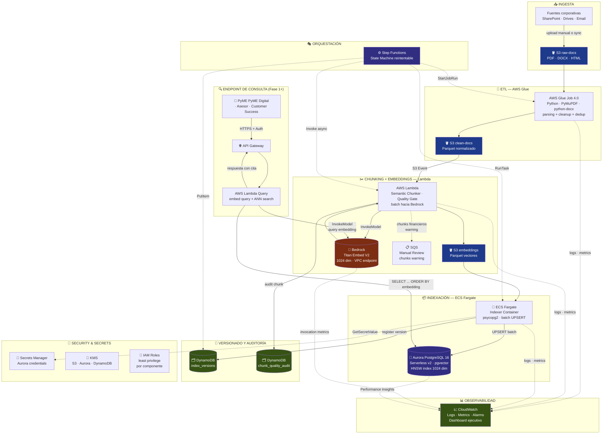

# Arquitectura AWS del Pipeline + Infraestructura como Código

**Documento:** 04 — Arquitectura AWS y Terraform
**Proyecto:** LLM Data Engineering Pipeline (Proyecto 12 — BSG Institute)
**Versión:** 1.0
**Fecha:** 2026-05-24
**Audiencia:** Equipo técnico Acme Co (Data Engineering, Cloud Architecture, Security)
**Región objetivo:** `us-east-1`

---

## Resumen ejecutivo

La arquitectura del pipeline RAG documental del Marketplace B2B PyME de Acme Co está diseñada como un **flujo serverless event-driven en AWS**, con orquestación centralizada en Step Functions y observabilidad integrada en CloudWatch. Sigue tres principios rectores que se derivan directamente del caso de uso y de la tesis Economic Graph:

1. **Cero datos fuera del perímetro AWS de Acme Co.** Bedrock se invoca por VPC endpoint privado; Aurora vive en subnets privadas; S3 y DynamoDB se acceden por gateway endpoints. La residencia y trazabilidad para LFPDPPP / CNBV es estructural, no opcional.
2. **Escalado por demanda real.** Aurora Serverless v2 escala a 0.5 ACU en valle; Lambda se cobra por invocación; Glue corre 1 vez al mes en reindexación completa. El techo de USD 500/mes para fase 1 (500 docs) es alcanzable sin sacrificar disponibilidad.
3. **Versionado por defecto.** Cada ejecución del pipeline registra una nueva versión inmutable en DynamoDB con hash del dataset, modelo de embedding y conteo de chunks. Habilita auditoría regulatoria, rollback y comparación A/B entre versiones del índice.

El componente Docker exigido por la rúbrica (#4, 8 pts) se cubre con el **loader containerizado en ECS Fargate** que carga embeddings desde Parquet hacia Aurora `pgvector`, lo cual además es la opción técnicamente correcta para cargas batch de larga duración (mayor RAM disponible, control de transacciones y conexiones DB) — mejor encaje que Lambda para este paso.

---

## 1. Diagrama de arquitectura (Mermaid)



> El endpoint de consulta (parte derecha del diagrama) está en alcance reducido para la fase 1 — se entrega como Lambda + API Gateway mínimo para validar el pipeline. El alcance completo del RAG generativo (interfaz conversacional con LLM) es **Año 2–3** de la tesis Economic Graph, fuera del proyecto.

---

## 2. Explicación por bloque

### 2.1 Ingesta — S3 `raw-docs`

El bucket `s3://<prefix>-raw-docs/` es el punto de entrada único del pipeline. Acepta PDFs, DOCX y HTML desde las fuentes corporativas del hub (SharePoint, drives compartidos de Marketplace Ops y catálogos vivos). Los documentos se versionan automáticamente (versioning activado a nivel bucket) y se cifran con SSE-KMS.

La carga puede ser manual (drag-and-drop desde la consola por Marketplace Ops) o automatizada vía AWS DataSync / scripts batch — la elección queda fuera del alcance del proyecto y se documenta como integración futura. Se aplica una **política de lifecycle** que mueve objetos no modificados a Intelligent-Tiering tras 90 días para optimizar costo.

Cada subida dispara opcionalmente un evento de Step Functions para iniciar el pipeline incremental, o se procesa en la corrida programada mensual de reindexación completa.

### 2.2 ETL — AWS Glue Job

El **Glue Job 4.0 (Python)** lee documentos crudos desde `/raw/`, ejecuta el parsing multi-formato (PyMuPDF para PDFs, `python-docx` para DOCX, `BeautifulSoup` + `markdownify` para HTML), aplica limpieza (UTF-8 NFC, normalización de whitespace, deduplicación de headers/footers vía análisis de n-gramas), y emite el resultado a `/clean/` en formato Parquet. Las columnas del Parquet de salida son: `document_id`, `page_number`, `raw_text`, `section_path`, `doc_type`, `vertical`, `source_filename`, `extracted_at`.

Glue se elige sobre Lambda para el ETL porque (a) los PDFs grandes pueden requerir más de 15 minutos por documento, (b) la concurrencia se controla por DPUs y no por límites de Lambda, y (c) los workers Spark de Glue permiten paralelización por documento sin orquestación custom. El job se configura con `WorkerType=G.1X` y `NumberOfWorkers=4` para fase 1; escalable a 10 workers para fase 2.

Cada ejecución del Glue Job emite métricas custom a CloudWatch: `DocumentsProcessed`, `DocumentsFailed`, `AvgParseDurationMs`, `TotalChunksEmitted`. El log detallado se puede inspeccionar por `document_id` en CloudWatch Logs Insights.

### 2.3 Chunking + Embeddings — AWS Lambda + Bedrock Titan

**Lambda function** disparada por evento S3 sobre `/clean/`. Para cada fila del Parquet, aplica el Semantic Chunking Pattern descrito en `docs/03_semantic_chunking_pattern.md` (500–1,500 tokens dinámicos, overlap 200, Quality Gate de 7 reglas con regla maestra `financial`). Los chunks que pasan el gate se agrupan en batches de hasta 50 textos y se envían a **Bedrock Titan Embed V2** por una sola invocación, optimizando latencia y costo.

La comunicación entre Lambda y Bedrock viaja por un **VPC interface endpoint privado** — los textos sensibles (cláusulas Carrier Billing, scoring) nunca cruzan internet pública. La respuesta de Bedrock incluye el vector de 1024 dimensiones, que se agrega como columna `embedding` al Parquet de salida en `s3://<prefix>-embeddings/`. Las columnas del Parquet son: `chunk_id`, `document_id`, `chunk_index`, `section_path`, `vertical`, `doc_type`, `criticality`, `metadata_json`, `embedding` (`list<float>[1024]`).

Los chunks con verdict `warning` se enrutan adicionalmente a un **SQS de revisión humana** con la razón del warning, donde un revisor (Marketplace Ops para `financial`, Data Eng para `low_ocr_quality`) decide si reprocesar el documento, ajustar reglas del gate, o aceptar el chunk con anotación. Los chunks con verdict `discard` se registran en la tabla `chunk_quality_audit` de DynamoDB para auditoría LFPDPPP.

### 2.4 Indexación — ECS Fargate + Aurora PostgreSQL `pgvector`

El **loader containerizado** corre en **ECS Fargate** (1 vCPU, 2 GB RAM por tarea) y se compone de una imagen Docker multi-stage Python que: (a) lee Parquet desde `s3://<prefix>-embeddings/` con `pyarrow`, (b) obtiene credenciales de Aurora desde Secrets Manager, (c) ejecuta UPSERT batch contra Aurora (`ON CONFLICT (chunk_id) DO UPDATE`) en transacciones de 500 filas, y (d) registra una nueva versión del índice en DynamoDB al cierre exitoso.

**Aurora PostgreSQL Serverless v2** está configurado en modo `min=0.5 ACU, max=2 ACU` (escalable a 8 ACU para fase 2), con la extensión `pgvector` activada (PostgreSQL 16.x soporta `pgvector` nativo). La tabla `documents_embeddings` declara la columna `embedding` como `vector(1024)` con índice HNSW (`m=16`, `ef_construction=64`). Aurora vive en subnets privadas dentro de la VPC del proyecto; sólo el SG `aurora-sg` acepta ingress en 5432 desde los SGs `lambda-sg`, `ecs-sg` y `query-sg`.

El loader se elige como **contenedor en Fargate** y no como Lambda porque: (1) la carga puede durar varios minutos (4,000 chunks × ~10 ms cada UPSERT = ~40 s, pero con conexión cold-start de Aurora y commit por batches puede crecer); (2) la gestión de conexión a PostgreSQL es no-trivial en Lambda (connection pooling, IPv6 issues); (3) el componente Docker satisface el requisito #4 de la rúbrica del Proyecto 12 (8 pts).

### 2.5 Versionado y Auditoría — DynamoDB

Dos tablas DynamoDB on-demand cubren versionado y auditoría:

- **`index_versions`** — PK: `version_id` (KSUID o UUID), atributos: `created_at`, `documents_count`, `chunks_count`, `embeddings_count`, `embedding_model` (`amazon.titan-embed-text-v2:0`), `dataset_hash` (SHA-256 del set de documentos), `cost_estimate_usd`, `git_commit` (referencia al commit del pipeline), `notes`. Habilita rollback por versión (cambiar el alias activo) y comparación A/B entre versiones.
- **`chunk_quality_audit`** — PK: `chunk_id`, SK: `version_id`. Atributos: `verdict` (`pass` / `warning` / `discard`), `reasons[]`, `metrics_json` (length, ttr, ocr_conf), `document_id`, `criticality`, `timestamp`. Habilita auditoría regulatoria LFPDPPP sobre cualquier chunk individual.

Ambas tablas usan **PAY_PER_REQUEST** (on-demand) — el volumen es moderado (4,000 escrituras por reindexación completa, ~50,000 lecturas/mes), lejos del punto donde provisioned capacity tendría sentido. TTL no se activa: la trazabilidad regulatoria exige retención mínima de 5 años.

### 2.6 Orquestación — AWS Step Functions

Una **state machine de Step Functions** orquesta el pipeline end-to-end con reintentos exponenciales y manejo de fallos por estado. Estados principales:

1. `StartGlueJob` — invoca el Glue Job de ETL (mode `RUN`, espera asíncrona).
2. `WaitForGlueCompletion` — polling cada 30 s con timeout 60 min.
3. `FanOutLambda` — invoca Lambda de chunking en modo paralelo (Map state) con concurrencia controlada (50).
4. `RunECSIndexer` — lanza la tarea Fargate del loader.
5. `RegisterVersion` — `PutItem` en `index_versions` con metadata de la ejecución.
6. `NotifySuccess` — SNS a un topic `pipeline-success`.

Cada estado tiene retry policy: 3 reintentos con backoff exponencial (intervalos 2s, 8s, 32s) para errores transitorios (`Lambda.ServiceException`, `Glue.Throttle`, `Aurora.ConnectionTimeout`). Errores permanentes (`DocumentParseError`, `BedrockAccessDenied`) van a un estado `Catch` que registra el incidente en CloudWatch y notifica a SNS `pipeline-failure`.

La state machine se puede invocar manualmente (consola, CLI) o programada vía EventBridge (cron `0 2 1 * ? *` = primer día del mes a las 2 AM para reindexación completa).

### 2.7 Observabilidad — CloudWatch

**CloudWatch Logs:** todos los componentes (Glue, Lambda, ECS, API Gateway) emiten logs estructurados en JSON con campos `pipeline_run_id`, `document_id`, `chunk_id`, `severity`. Esto permite búsquedas con CloudWatch Logs Insights tipo:

```
fields @timestamp, document_id, chunk_id, severity, message
| filter pipeline_run_id = "run-2026-05-24-001"
| filter severity = "ERROR"
| sort @timestamp desc
```

**CloudWatch Metrics:** métricas estándar (`Lambda.Errors`, `Lambda.Duration`, `Glue.glue.driver.aggregate.recordsRead`, `RDS.DatabaseConnections`) + métricas custom emitidas por el código (`Chunks.Generated`, `Chunks.Discarded`, `Chunks.WarningFinancial`, `Embedding.Cost.USD`).

**Dashboard ejecutivo de CloudWatch** con widgets para: tiempos de ejecución de Glue, errores de Lambda chunking, número de documentos procesados por ejecución, costos estimados (sumatoria de `Embedding.Cost.USD` × 30 días), distribución del Quality Gate (`pass` / `warning` / `discard` por `doc_type`), latencia de queries vectoriales en Aurora (vía Performance Insights). Detalles del dashboard en `docs/09_versionamiento_observabilidad.md`.

**Alarms** con notificación SNS a Operaciones:
- `GlueJobFailureRate > 5%` (en ventana de 1 día)
- `LambdaErrors > 20` en 5 minutos
- `BedrockThrottlingExceptions > 10/min`
- `AuroraStorageUsed > 80%`
- `MonthlyCost > 80% del techo USD 500`

### 2.8 VPC, Networking y Security

**VPC** dedicada con CIDR `10.42.0.0/16`, 2 AZ (us-east-1a, us-east-1b) y 2 subnets privadas (`/24` cada una). No hay subnets públicas — el pipeline es 100% interno; el endpoint de consulta sale por API Gateway sin requerir egress de las Lambdas.

**Security Groups:**
- `aurora-sg`: ingress 5432 desde `lambda-sg`, `ecs-sg`, `query-sg`. Egress vacío.
- `lambda-sg`: egress 443 a Bedrock endpoint, gateway S3, KMS, Secrets Manager.
- `ecs-sg`: egress 443 a S3, KMS, Secrets Manager; 5432 a `aurora-sg`.
- `query-sg`: igual que `lambda-sg`.

**VPC Endpoints (Fase 1):**
- **Gateway endpoints (gratuitos):** S3 y DynamoDB.
- **Interface endpoints (pago, ~USD 8/mes c/u):** Bedrock Runtime, Secrets Manager, CloudWatch Logs.

**IAM principle of least privilege:** cada componente recibe un IAM Role con las acciones mínimas necesarias. Detalle en sección 3 de este documento y en `infra/iam.tf`.

**KMS:** llaves AWS-managed para fase 1 (`alias/aws/s3`, `alias/aws/rds`, `alias/aws/dynamodb`). Migración a Customer Managed Keys (CMK) está en roadmap para fase 2 cuando el corpus financiero alcance umbrales que CNBV exija KMS dedicado.

### 2.9 Endpoint de Consulta (alcance reducido fase 1)

Una **Lambda Query** detrás de **API Gateway** expone el endpoint `POST /search` que recibe `{ "query": "...", "k": 5, "filters": { "vertical": "...", "criticality": "..." } }`. La Lambda: (1) genera el embedding de la query con Bedrock Titan, (2) ejecuta SELECT vectorial sobre Aurora con `ORDER BY embedding <=> $1 LIMIT $2` y filtros opcionales, (3) devuelve los k chunks más cercanos con su `section_path`, `source_filename` y `criticality` para citación verificable.

Autenticación inicial vía **API Gateway API Keys**; migración a **Cognito** en fase 1.1 cuando el endpoint se exponga a PyMEs. Para el subset financiero (`criticality=financial`), la respuesta incluye obligatoriamente el `version_id` del índice activo y la URL firmada al documento fuente en S3 — requisito CNBV.

---

## 3. IAM — resumen de permisos mínimos

| Rol | Permisos clave | Recursos |
|---|---|---|
| `glue-etl-role` | `s3:GetObject` en `/raw/*`, `s3:PutObject` en `/clean/*`, `logs:*`, `secretsmanager:GetSecretValue` | Buckets S3, Log group `/aws/glue/jobs/etl` |
| `lambda-chunking-role` | `s3:GetObject` en `/clean/*`, `s3:PutObject` en `/embeddings/*`, `bedrock:InvokeModel` (modelo Titan V2), `dynamodb:PutItem` en `chunk_quality_audit`, `sqs:SendMessage` en `manual-review-queue`, `logs:*` | Buckets S3, Bedrock model ARN, tabla DDB, SQS, Log group |
| `ecs-indexer-role` | `s3:GetObject` en `/embeddings/*`, `secretsmanager:GetSecretValue` en Aurora secret, `dynamodb:PutItem` en `index_versions`, `logs:*` | Bucket S3, secret ARN, tabla DDB, Log group |
| `ecs-task-execution-role` | Roles estándar de ejecución Fargate (`AmazonECSTaskExecutionRolePolicy`) | ECR pull, CloudWatch logs |
| `stepfunctions-role` | `glue:StartJobRun`, `lambda:InvokeFunction`, `ecs:RunTask`, `iam:PassRole` (limitado a roles del pipeline), `dynamodb:PutItem`, `sns:Publish` | ARNs específicos |
| `query-lambda-role` | `bedrock:InvokeModel`, conexión a Aurora vía Secrets Manager, `logs:*` | Bedrock ARN, secret, Log group |

Los roles se definen en `infra/iam.tf`. Ningún rol tiene `*` en `Resource` ni `Action` — todo es explícito.

---

## 4. Estimación de costos detallada (mensual, fase 1 — 500 docs)

| Componente | Concepto | Costo estimado USD/mes |
|---|---|---|
| **Aurora Serverless v2** | 0.5–2 ACU promedio 1 ACU, $0.12/ACU-hr × 730 hr | **~$88** |
| **Aurora storage** | 5 GB × $0.10/GB-mes | $0.50 |
| **VPC Interface Endpoints** | Bedrock + Secrets Manager + CloudWatch Logs (~$8 c/u) | $24 |
| **Bedrock Titan V2 (embeddings)** | 5M tokens × $0.02/1M | $0.10 |
| **Bedrock Titan V2 (queries)** | 75K tokens × $0.02/1M | $0.002 |
| **AWS Lambda (chunking)** | ~4000 chunks × 1 GB-s × $0.0000166 | ~$5 |
| **AWS Lambda (query)** | 1500 invocaciones × 256 MB × 500 ms | ~$0.10 |
| **AWS Glue Job** | 4 DPU × 30 min × 1 vez/mes × $0.44/DPU-hr | ~$0.90 |
| **ECS Fargate Indexer** | 1 vCPU + 2 GB × 30 min × 1 vez/mes | ~$0.50 |
| **S3 (storage + requests)** | 50 GB × $0.023/GB + ~10K PUT | ~$1.50 |
| **DynamoDB on-demand** | ~50K reads + ~10K writes | ~$1 |
| **CloudWatch Logs** | ~5 GB ingest + 1 GB stored | ~$5 |
| **CloudWatch Metrics + Alarms** | 10 custom metrics + 5 alarms | ~$5 |
| **Step Functions** | ~30 ejecuciones × ~50 transiciones | ~$0.50 |
| **API Gateway (HTTP)** | 1500 requests × $1/M | ~$0.002 |
| **KMS / Secrets Manager** | 3 secrets × $0.40 + key usage | ~$2 |
| **Data transfer (intra-region)** | Mínimo | ~$2 |
| **Buffer de variabilidad (~20%)** | | ~$25 |
| **TOTAL ESTIMADO MENSUAL** | | **~$160** |

> **Margen de seguridad:** el techo declarado es USD 500/mes — la estimación actual deja **~70% de margen** para fase 1. La línea dominante es Aurora Serverless v2; con `min=0.5 ACU` y carga real moderada, podría bajar a USD 50–60. Reindexación más frecuente (semanal) sumaría ~$0.50/mes adicional.

---

## 5. Estructura de archivos Terraform

```
infra/
├── README.md             # Instrucciones de despliegue
├── versions.tf           # Versiones de Terraform y providers
├── variables.tf          # Variables de entrada
├── main.tf               # Provider config + locals + tags comunes
├── vpc.tf                # VPC, subnets, route tables, gateway endpoints
├── security_groups.tf    # SGs para Aurora, Lambda, ECS, Query
├── s3.tf                 # 3 buckets (raw, clean, embeddings) + lifecycle
├── secrets.tf            # Random password + Secrets Manager para Aurora
├── aurora.tf             # Aurora Serverless v2 cluster + pgvector param group
├── dynamodb.tf           # 2 tablas (index_versions, chunk_quality_audit)
├── iam.tf                # Roles para Glue, Lambda, ECS, Step Functions
├── outputs.tf            # Outputs útiles (endpoints, ARNs, bucket names)
└── terraform.tfvars.example  # Plantilla con valores de ejemplo
```

> **Lo que NO incluye este primer borrador:** Glue Job, Lambda Functions, ECS Task Definition, Step Functions State Machine, API Gateway. Esas resources se definirán al cerrar Prompts 6/7/8/9 cuando el código real exista — sería prematuro declararlas en Terraform sin el handler/job apuntando a un artifact real. **Lo que SÍ está listo:** todos los recursos foundation (storage, DB, secrets, IAM, networking) sobre los que el compute se monta.

---

## 6. Plan de despliegue

```powershell
# 1. Entrar a infra/
cd "C:\Users\Rog\OneDrive\BCG Institute\Arquitectura Escalable\Proyecto_Final\infra"

# 2. Copiar plantilla y ajustar valores
Copy-Item terraform.tfvars.example terraform.tfvars
# editar terraform.tfvars con project_name, environment, etc.

# 3. Verificar credenciales AWS
aws sts get-caller-identity

# 4. Inicializar
terraform init

# 5. Validar
terraform validate

# 6. Ver plan (NO crea recursos)
terraform plan -out=tfplan

# 7. Aplicar (CREA RECURSOS — Aurora costará ~$1/día a partir de aquí)
terraform apply tfplan

# 8. Cuando termines de probar
terraform destroy
```

> **Aviso de costo:** `terraform apply` provisiona Aurora Serverless v2 (mínimo 0.5 ACU = ~$1.50/día idle), VPC Interface Endpoints (~$0.80/día), y los buckets/tablas (centavos al mes). Para evitar cargos mientras no se usa, `terraform destroy` es seguro y reversible. Aurora puede tardar 10–15 min en crearse y otros 5–10 min en destruirse.

Habilitar acceso a Bedrock Titan V2 antes del primer apply real (no es Terraform, es consola AWS):

```powershell
# Verificar acceso
aws bedrock list-foundation-models --region us-east-1 --by-provider amazon |
  Select-String "titan-embed-text-v2"

# Si no aparece habilitado:
# AWS Console → Bedrock → Model access → request access
# Amazon → Titan Text Embeddings V2 → Submit
```

---

## 7. Riesgos arquitectónicos y mitigaciones

| Riesgo | Probabilidad | Impacto | Mitigación |
|---|---|---|---|
| Costo de Aurora Serverless v2 escala por encima del techo en pico de reindexación | Media | Medio | `max_capacity = 2 ACU` en fase 1 (caps a ~$170/mes total). Reindexar fuera de horario laboral para minimizar contention. |
| Quota inicial de Bedrock insuficiente para reindexación completa rápida | Media | Medio | Solicitar aumento de quota a Service Quotas anticipadamente (típicamente aprobado en horas). |
| VPC sin egress a internet bloquea descarga de paquetes Python en Lambda | Alta | Medio | Lambda Layer pre-construido con dependencias; o NAT Gateway dedicado (sumaría ~$33/mes — se evita por costo). |
| Aurora `pgvector` no disponible en versión de engine elegida | Baja | Alto | Usar PostgreSQL 16.6+ (soporte nativo). Validar con `SELECT version()` post-deploy. |
| Pérdida accidental por `terraform destroy` en cluster con datos productivos | Media | Alto | Activar `deletion_protection = true` en fase 1.1 (cuando haya datos reales). Backups de Aurora con retención 7 días. |
| Fuga de credenciales Aurora si `terraform.tfstate` se commitea | Alta | **Crítico** | `.gitignore` excluye `*.tfstate`. Backend remoto (S3 + DynamoDB lock) se documenta como mejora fase 1.1. |

---

**Documentos relacionados:**
- `01_caso_de_uso.md` — KPIs y restricción de costo USD 500/mes
- `02_seleccion_embeddings.md` — Titan V2 con 1024 dim; sustenta `vector(1024)` en Aurora
- `03_semantic_chunking_pattern.md` — Diseño del chunker que ejecuta esta Lambda
- `08_indexacion_aurora_pgvector.md` — DDL específico de `documents_embeddings`
- `09_versionamiento_observabilidad.md` — Esquemas DDB y dashboard CloudWatch
- `infra/README.md` — Instrucciones detalladas de Terraform
