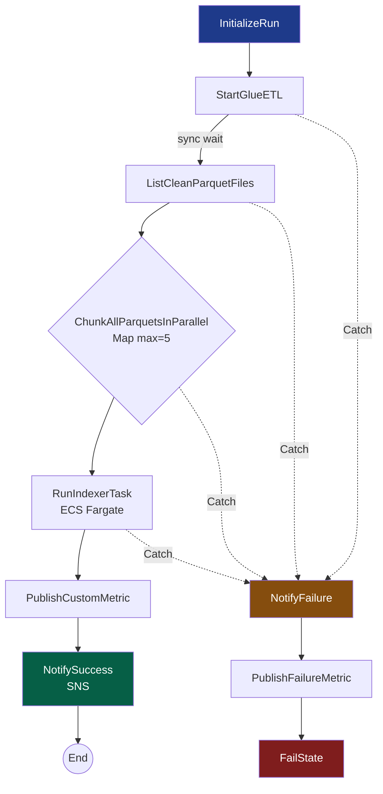

# Orchestration — Step Functions State Machine

Este módulo contiene la **state machine de AWS Step Functions** que orquesta el pipeline RAG end-to-end:

```
InitializeRun → StartGlueETL → ListCleanParquetFiles
   → ChunkAllParquetsInParallel (Map, concurrency=5)
   → RunIndexerTask (ECS Fargate)
   → PublishCustomMetric → NotifySuccess
                 ↘ Catch errores → NotifyFailure → PublishFailureMetric → FailState
```

## Archivo principal

- **`state_machine.json.tpl`** — definición Amazon States Language (ASL) con placeholders Terraform.
- Se renderiza con `templatefile()` en `infra/stepfunctions.tf`.

## Sustituciones del template

| Variable | Origen Terraform |
|---|---|
| `${glue_job_name}` | `aws_glue_job.etl.name` |
| `${raw_bucket}` | `aws_s3_bucket.raw_docs.bucket` |
| `${clean_bucket}` | `aws_s3_bucket.clean_docs.bucket` |
| `${lambda_chunking_function_name}` | `aws_lambda_function.chunking[0].function_name` |
| `${ecs_cluster_arn}` | `aws_ecs_cluster.this.arn` |
| `${ecs_task_definition_arn}` | `aws_ecs_task_definition.indexer[0].arn` |
| `${ecs_security_group_id}` | `aws_security_group.ecs.id` |
| `${private_subnets_json}` | `jsonencode(aws_subnet.private[*].id)` |
| `${sns_success_topic_arn}` | `aws_sns_topic.pipeline_success.arn` |
| `${sns_failure_topic_arn}` | `aws_sns_topic.pipeline_failure.arn` |
| `${environment}` | `var.environment` |

## Comportamiento por estado

| Estado | Tipo | Comportamiento clave |
|---|---|---|
| `InitializeRun` | Pass | Genera `version_id = run-<ExecutionName>` |
| `StartGlueETL` | Task (`glue:startJobRun.sync`) | Espera al Glue job; retry 3× sobre concurrency / 2× sobre fallos genéricos |
| `ListCleanParquetFiles` | Task (`s3:listObjectsV2`) | Enumera los Parquet emitidos por Glue |
| `ChunkAllParquetsInParallel` | **Map** | Invoca Lambda por cada Parquet, MaxConcurrency=5 (proteger cuotas Bedrock); retries exponenciales sobre throttling |
| `RunIndexerTask` | Task (`ecs:runTask.sync`) | Lanza Fargate task con `VERSION_ID` propagado; retry 2× |
| `PublishCustomMetric` | Task (`cloudwatch:putMetricData`) | Emite `RAGPipeline/PipelineRunsSucceeded` |
| `NotifySuccess` | Task (`sns:publish`) | Envía resumen al topic de éxito |
| `NotifyFailure` | Task (`sns:publish`) | Captura cualquier error con `States.JsonToString($)` |
| `PublishFailureMetric` | Task | Emite `RAGPipeline/PipelineRunsFailed` |
| `FailState` | Fail | Termina en estado `FAILED` (visible en CloudWatch) |

## Invocación

### Manual (desde CLI)

```powershell
$smArn = terraform -chdir=../infra output -raw state_machine_arn
aws stepfunctions start-execution `
    --state-machine-arn $smArn `
    --name "manual-$(Get-Date -Format 'yyyyMMddTHHmmssZ')" `
    --input '{"trigger":"manual"}' `
    --no-verify-ssl
```

### Manual (consola)

AWS Console → Step Functions → State machines → `bsg-acmeco-rag-dev-pipeline` → Start execution.

### Programada (mensual, opcional)

```hcl
# En terraform.tfvars
enable_scheduled_reindex = true
```

Esto crea un `aws_scheduler_schedule` que dispara el pipeline el día 1 de cada mes a las 02:00 UTC.

### Por eventos de S3 (incremental)

La Lambda chunking ya está suscrita a eventos `ObjectCreated:*` en `clean-docs/clean/*.parquet` (configurado en `infra/lambda.tf`). Esto cubre el caso de subir documentos sueltos sin pasar por toda la state machine.

> **Coordinación de los dos flujos:** la Lambda es idempotente (chunk_id basado en content_hash). Aunque la state machine también invoque la Lambda, no genera duplicados — el UPSERT de Aurora se encarga de la convergencia. Sí pueden generarse versiones DDB extra; se documenta como behaviour aceptado.

## Observabilidad

| Métrica | Donde |
|---|---|
| `AWS/States/ExecutionsSucceeded` | Auto-emit por Step Functions |
| `AWS/States/ExecutionsFailed` | Auto-emit + Alarm `sfn-executions-failed` |
| `AWS/States/ExecutionTime` (P50/P95/Max) | Dashboard widget |
| `RAGPipeline/PipelineRunsSucceeded` | Emit explícito en `PublishCustomMetric` |
| `RAGPipeline/PipelineRunsFailed` | Emit explícito en `PublishFailureMetric` |
| Logs estructurados | CloudWatch Log Group `/aws/vendedlogs/states/${prefix}-pipeline` |
| X-Ray traces | `tracing_configuration.enabled = true` |

## Manejo de errores

Cada Task tiene **`Retry`** (transient errors) y **`Catch`** (permanent → notify):

| Error | Acción |
|---|---|
| `Glue.ConcurrentRunsExceededException` | Retry 3× con backoff exponencial 60s/2x |
| `Lambda.TooManyRequestsException` | Retry 4× con jitter FULL (mitiga thundering herd) |
| `ECS.AmazonECSException` | Retry 2× |
| Cualquier otro (`States.ALL`) | Catch → `NotifyFailure` → SNS → `FailState` |

## Limitaciones conocidas

1. **MaxConcurrency=5** en el Map para no saturar Bedrock. Si la cuenta tiene cuotas ampliadas, subir a 10 o 20.
2. **`ResultPath`** se preserva entre states usando `$.glue_result`, `$.parquet_list`, etc. Para corpus > 1,000 Parquets, considerar **Distributed Map** (mayor paralelismo + S3 manifest) en lugar de Map inline.
3. El **timeout global** de la state machine es 5,400 s (90 min). Para reindexaciones que excedan, dividir en sub-state-machines.
4. **Costo de Step Functions Standard:** $25 por millón de transiciones. Una corrida del pipeline son ~10 transiciones → ~$0.00025 por run.

## Diagrama del flujo



## Próximos pasos

- **Prompt 10** — Guías Usuario / Admin con runbook operativo de esta state machine.
- **Backlog** — Distributed Map para corpus > 1,000 Parquets.
- **Backlog** — Sub-state-machine para reintento granular de documentos fallidos (no toda la ejecución).
